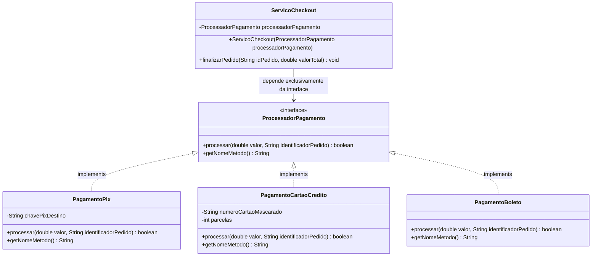

# Exemplo Prático de Desacoplamento com Interfaces em Java

Este projeto demonstra, de forma prática e didática, como utilizar **interfaces** em Java para **desacoplar componentes de um sistema**, garantindo que componentes de alto nível (consumidores) dependam exclusivamente de abstrações (contratos) e não de implementações concretas.

---

## 🎯 Objetivo da Atividade

Demonstrar o uso de interfaces para:
1. Definir um **contrato formal** de comunicação entre componentes.
2. Permitir que **múltiplas implementações** desse contrato coexistam e sejam intercambiáveis.
3. Garantir que o **componente consumidor** dependa apenas da interface, sem conhecer detalhes de baixo nível das implementações concretas (Princípio da Inversão de Dependência - DIP do SOLID).

---

## 📂 Estrutura do Projeto

```text
atividade_interface_arquitetura/
├── README.md                                           # Documentação da atividade
└── src/
    └── com/
        └── exemplo/
            └── pagamento/
                ├── ProcessadorPagamento.java           # 1. Interface (Contrato)
                ├── PagamentoPix.java                   # 2. Implementação Concreta 1 (PIX)
                ├── PagamentoCartaoCredito.java         # 2. Implementação Concreta 2 (Cartão)
                ├── PagamentoBoleto.java                # 2. Implementação Concreta 3 (Boleto)
                ├── ServicoCheckout.java                # 3. Componente Consumidor
                └── Main.java                           # Demonstração e execução prática
```

---

## 🏗️ Arquitetura e Diagrama de Classes



---

## 🔍 Descrição dos Componentes

### 1. Interface (Contrato): [`ProcessadorPagamento`](src/com/exemplo/pagamento/ProcessadorPagamento.java)
Define a assinatura obrigatória que qualquer processador de pagamento deve cumprir:
```java
public interface ProcessadorPagamento {
    boolean processar(double valor, String identificadorPedido);
    String getNomeMetodo();
}
```

### 2. Implementações Concretas:
- [`PagamentoPix`](src/com/exemplo/pagamento/PagamentoPix.java): Lida com detalhes específicos de QR Code, chaves PIX e confirmação instantânea.
- [`PagamentoCartaoCredito`](src/com/exemplo/pagamento/PagamentoCartaoCredito.java): Gerencia autorização de operadoras, validação de risco e parcelamento.
- [`PagamentoBoleto`](src/com/exemplo/pagamento/PagamentoBoleto.java): Emite código de barras/linha digitável com vencimento.

### 3. Componente Consumidor: [`ServicoCheckout`](src/com/exemplo/pagamento/ServicoCheckout.java)
- Depende **apenas da interface `ProcessadorPagamento`**.
- O meio de pagamento concreto é recebido via **Injeção de Dependência** em seu construtor.
- Se amanhã for criado um `PagamentoCripto` ou `PagamentoPayPal`, **nenhuma linha** do `ServicoCheckout` precisará ser alterada.

---

## 🚀 Como Compilar e Executar

Abra o terminal na raiz do projeto (`atividade_interface_arquitetura`) e execute:

### 1. Compilar os arquivos Java:
```bash
javac src/com/exemplo/pagamento/*.java
```

### 2. Executar a demonstração:
```bash
java -cp src com.exemplo.pagamento.Main
```

---

## 🖥️ Saída Esperada no Terminal

```text
#################################################################
#  DEMONSTRAÇÃO DE DESACOPLAMENTO COM INTERFACES EM JAVA       #
#################################################################

=================================================================
>> Iniciando Checkout do Pedido: PED-001
>> Valor Total: R$ 189,90
>> Método Selecionado: PIX Instantâneo
  [PagamentoPix] Gerando QR Code PIX para a chave: contato@lojaexemplo.com.br
  [PagamentoPix] Transação registrada: PIX-9A2B4C6D
  [PagamentoPix] Cobrança de R$ 189,90 aprovada instantaneamente para o pedido PED-001
>> STATUS: Pedido PED-001 finalizado e confirmado com sucesso!
=================================================================

=================================================================
>> Iniciando Checkout do Pedido: PED-002
>> Valor Total: R$ 750,00
>> Método Selecionado: Cartão de Crédito (3x)
  [PagamentoCartaoCredito] Comunicando com a adquirente do cartão final **** **** **** 4321
  [PagamentoCartaoCredito] Análise de risco/antifraude: APROVADO
  [PagamentoCartaoCredito] Transação de R$ 750,00 parcelada em 3x de R$ 250,00
  [PagamentoCartaoCredito] Código de autorização: AUTH-CC-1E2F3A4B
>> STATUS: Pedido PED-002 finalizado e confirmado com sucesso!
=================================================================

=================================================================
>> Iniciando Checkout do Pedido: PED-003
>> Valor Total: R$ 45,50
>> Método Selecionado: Boleto Bancário
  [PagamentoBoleto] Gerando linha digitável: 34191.79001 01043.510047 91020.150008 5 -123456789
  [PagamentoBoleto] Boleto no valor de R$ 45,50 gerado com vencimento para 3 dias úteis.
>> STATUS: Pedido PED-003 finalizado e confirmado com sucesso!
=================================================================
```

---

## 📌 Princípios de Arquitetura Aplicados

- **Dependency Inversion Principle (DIP)**: O `ServicoCheckout` (módulo de alto nível) não depende de `PagamentoPix` ou `PagamentoCartaoCredito` (módulos de baixo nível). Ambos dependem da abstração `ProcessadorPagamento`.
- **Open/Closed Principle (OCP)**: O sistema está aberto para extensão (novos meios de pagamento podem ser adicionados criando novas classes que implementam a interface) e fechado para modificação (o `ServicoCheckout` permanece intacto).
- **Polimorfismo**: O método `processar` executa comportamentos completamente distintos em tempo de execução de acordo com o objeto injetado.
